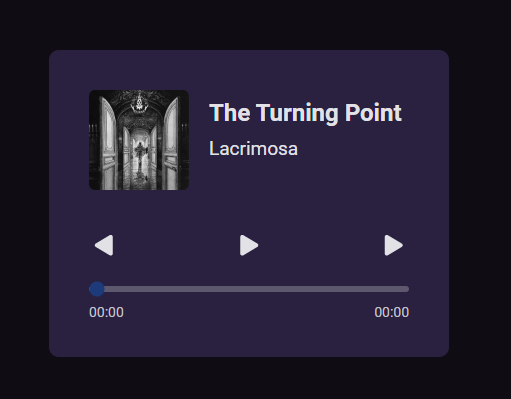

<h1>#BoraCodar desafio 01</h1>
<h2>Player Music</h2>

 Esse foi o primeiro desafio da rocketseat #boraCodar, nesse desafio tive que desenvolver um player de música, onde coloquei em pratica meus conhecimentos em javascript 

[acesse o projeto aqui!](https://gabriel-vitebo.github.io/player-music/)

<h3>o que usei nesse projeto<h3>

<ul>
  <li>HTML</li>
  <li>CSS</li>
  <li>JavaScript</li>
  <li>Git Github</li>
  

 O projeto contem apenas 7 músicas da minha escolha, apenas para demonstrar como funciona o player

<h3> Contato: vitebo@outlook.com</h3>